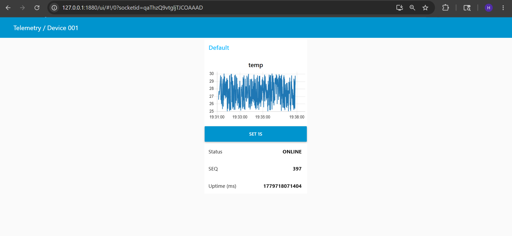
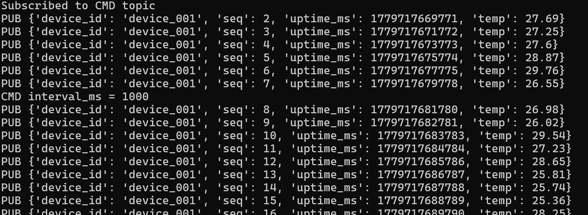

# MQTT Telemetry Dashboard System

Node-RED and Python-based MQTT telemetry monitoring platform implementing real-time dashboard visualization, telemetry simulation, command/control workflows, and device status monitoring.

---

## Features

- Real-time MQTT telemetry visualization
- Python telemetry simulator
- Node-RED dashboard integration
- ONLINE/OFFLINE device monitoring
- MQTT command publishing
- Live telemetry graph plotting
- Sequence counter monitoring
- Uptime monitoring
- CSV telemetry logging

---

## System Architecture

```text
Python Telemetry Publisher
        ↓
MQTT Broker
        ↓
Node-RED Dashboard
        ↓
Real-Time Monitoring + Command Control
```

---

## Components

### Python Telemetry Simulator

- Simulates IoT telemetry generation
- Publishes JSON telemetry payloads over MQTT
- Supports runtime command updates
- Adjustable telemetry interval
- Sequence tracking and uptime simulation

### Node-RED Dashboard

- Real-time telemetry visualization
- Live temperature graph plotting
- ONLINE/OFFLINE device monitoring
- MQTT command publishing
- Sequence and uptime monitoring
- Dashboard-based device interaction

---

## MQTT Topics

### Telemetry Topic

```text
edgepulse/manjunatha144/device_001/telemetry
```

### Command Topic

```text
edgepulse/manjunatha144/device_001/cmd
```

---

## Repository Structure

```text
.
├── node-red/
│   ├── flow_v1.json
│   └── flow_v2_cmd_offline.json
│
├── python/
│   ├── publisher.py
│   └── logger.py
│
├── screenshots/
│   ├── dashboard_v1.png
│   ├── dashboard_v2_final.png
│   └── publisher_command_output.png
│
└── README.md
```

---

## Dashboard Preview

### Live MQTT Dashboard



---

### MQTT Command Workflow



---

## Technologies Used

### Backend / Messaging

- Python
- MQTT
- Paho MQTT

### Dashboard / Visualization

- Node-RED
- Node-RED Dashboard

### Communication

- MQTT Protocol
- EMQX Public Broker

---

## Run Project

### Start Node-RED

```bash
node-red
```

Open:

```text
http://127.0.0.1:1880
```

Dashboard UI:

```text
http://127.0.0.1:1880/ui
```

---

### Run Python Telemetry Publisher

```bash
cd python
python publisher.py
```

---

## Example Telemetry Payload

```json
{
  "device_id": "device_001",
  "seq": 25,
  "uptime_ms": 1779717698802,
  "temp": 28.42
}
```

---

## Author

Manjunatha H  
Embedded and IoT Firmware Developer

GitHub: https://github.com/Manjunatha144
